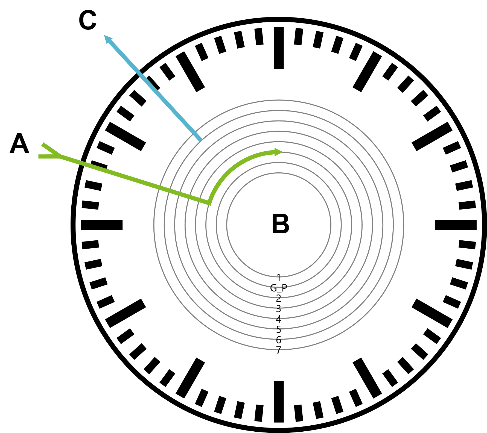
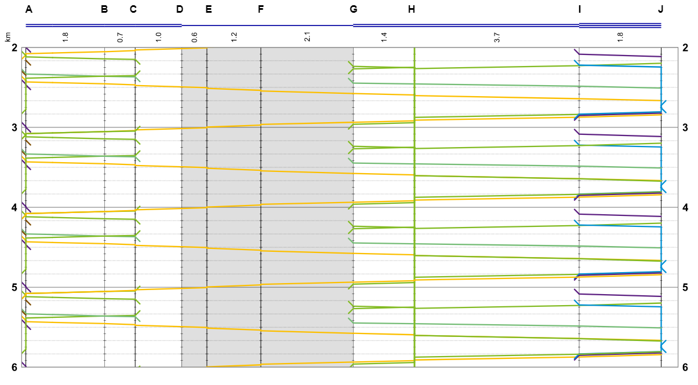
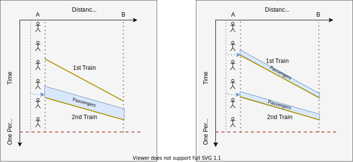
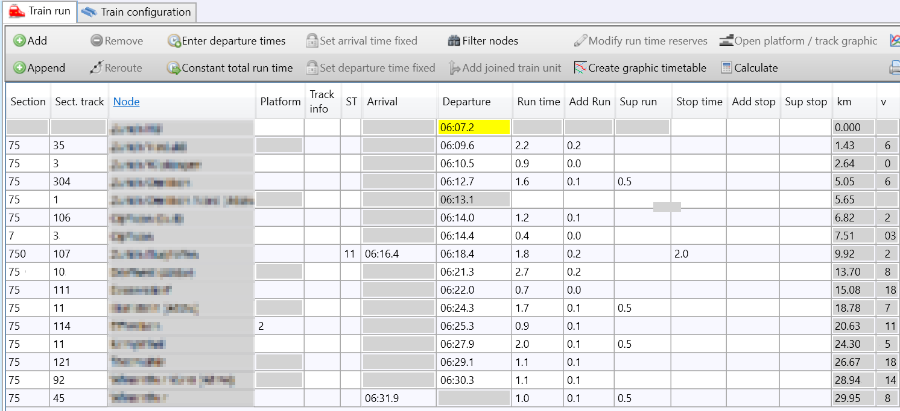
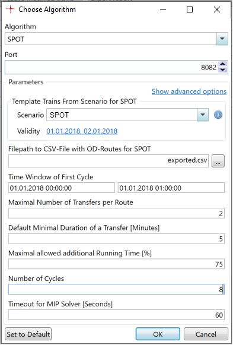
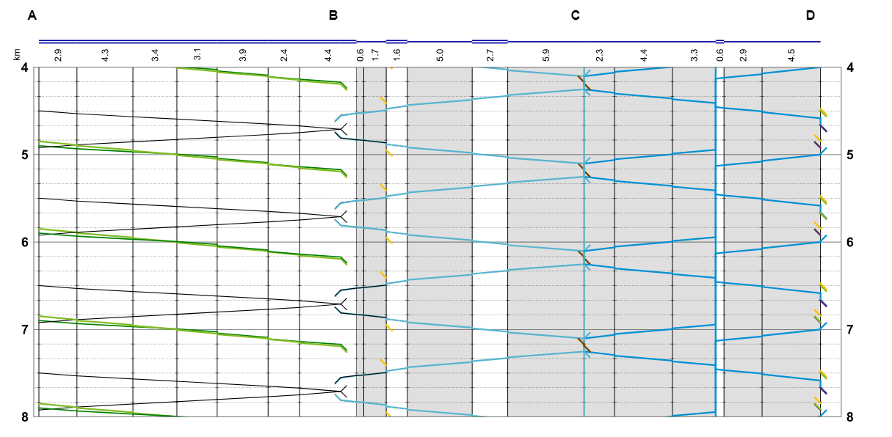
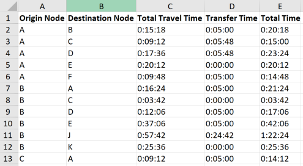
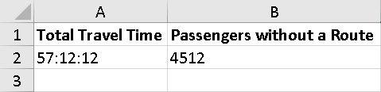

An implementation of an algorithm based on **SPOT** using Viriato's *Algorithm Platform*.

# *Abstract*
**SPOT** [[1]](#ref_1) is a mathematical model for strategic passenger railway planning building on the well-known _PESP_ (Periodic Event Scheduling Problem [[2]](#ref_2)). The goal of the **SPOT** model is to obtain an automatically generated and workable timetable during the strategic planning phase as it aims to provide a passenger-centric timetable.

We want to provide an implementation based on **SPOT** using Viriato's *Algorithm Platform* to deliver a software prototype that can be actually used by a subject-matter expert in practice so that the model's results can be assessed by them without any mathematical or programming background. We demonstrate the benefits that come with our *Algorithm Platform* to the researcher.

# Our Goals for this Implementation

We want to highlight the benefits that come with our *Algorithm Platform* to the researcher:

* **Data Acquisition and Provision.**
  The *Algorithm Platform* retrieves all data requested by the algorithm from Viriato's database and provides it via an
  interoperable REST interface. There is no need to write database queries.
* **Rapid Development.**
  The input data provision and the simple way of passing parameters in combination with the predefined domain data model (*AIDM*) reduce the development effort considerably.
* **Prevention from Misuse.**
  Relying on the *Algorithm Platform* reduces the chance for the algorithm developer to make errors, and also protects them from erroneous data due to the enforced invariants in *Algorithm Platform's Algorithm Interface*.
* **Visualisation of Results and Reports.**
     The user can easily explore the solution which was written back to Viriato, allowing them to inspect the structure of the results in the available modules and assess their correctness and quality. In addition, reports in form of Excel sheets are generated to present the parameters used and a summary of the solution to the user giving them insights.

Note that our implementation of **SPOT** deliberately deviates in some aspects from the original model in  [[1]](#ref_1) in order to enhance the applicability in practice. The main goal was to demonstrate the use of the Viriato Algorithm Platform rather than an analysis of the model.
  


# Introducing SPOT

As the input for **SPOT** we are given a list of origin-destination ("_OD_") relations describing the travel wishes of a set of passengers, and a set of trains that have a list of defined commercial stop locations and minimum travelling times between these node pairs.

The **SPOT** model routes passengers through a train network from their origin to their destination by modifying the arrival and departure times of the trains, therefore impacting the total travel times (consisting of transfer times at stations and travel times on trains) of the passengers being routed. The objective is to minimise the total travel time for all passengers of all _OD_ relations.

[Figure 1](#GraphicTimetableOneRelation) provides an example timetable generated with **SPOT**. In our small example, let there be only one _OD_ relation with _origin A_ and _destination D_. The given trains travel only from _A_ to _B_, _B_ to _C_ and _C_ to _D_. Therefore, passengers have to change twice, once in _B_ and again in _C_. In this simple case where the only relation is for demand from _A_ to _D_, **SPOT** has optimised the arrival and departure at both changes, such that the transfer time is minimal.

<figure>
    <a id="GraphicTimetableOneRelation"></a>
    
    <caption><p style="text-align: center;">Figure 1: A graphic timetable for the example with two transfers. (Viriato screenshot).</p></caption>
</figure>


For this example, we defined five minutes as the required minimum transfer time. The connection clock in [Figure 2](#ConnectionClock) allows us to verify that the transfer time at _B_ is minimal, since the train to _C_ departs exactly five minutes after the arrival of the train from _A_.


<figure>
    <a id="ConnectionClock"></a>
    
    <caption><p style="text-align: center;">Figure 2: A connection clock for station <i>B</i>. (Viriato screenshot).</p></caption>
</figure>


# Deviations from the Theoretical **SPOT** Model

Our **SPOT** implementation deviates from the original in [[1]](#ref_1) in several places for sake of practical applicability.

## Cancelling of Commercially Irrelevant Parts of Trains

The **SPOT** model optimises travel times only for those parts of a train run which are used on a passenger's route. Depending on the input data, it may happen that parts of a train run are not used by any passenger in a **SPOT** solution, and this implies that the travel time on these parts are not necessarily optimised. Therefore it can happen that a train runs with an unrealistically slow speed on some track section in the solution. In practice, a train often spends a large part of this "idle" time stationary at a station. For sake of simplicity, we cancel these sub-parts in a solution if they occur at the beginning or at the end of a train run, and completely cancel and remove trains which not used at all by the algorithm. [Figure 3](#GraphicTimetableBig) shows a timetable, where irrelevant parts of scheduled trains have been cancelled.

Through using the Algorithm Platform's C# API wrapper methods _CancelTrain(...)_, _CancelTrainBefore(...)_ and _CancelTrainAfter(...)_ this is a straightforward operation.


<figure>
  <a id="GraphicTimetableBig"></a>
  
  <caption><p style="text-align: center;">Figure 3: A graphic timetable where all commercially irrelevant parts of trains have been cancelled. (Viriato screenshot).</p></caption>
</figure>

See ['Cancelling a Train'](#CancellingATrainCodeExample) for a code example.

## Simplified Passenger Routing

For sake of simplicity, in this case we chose to neglect the waiting time at a passenger's origin station. Moreover, at present we assume that all passengers of an _OD_ relation select the same travel route. This assumption contrasts with the implementation in [[1]](#ref_1), where the waiting time at the origin is considered. Therefore, not all passengers of an _OD_ relation travel via the same route. The difference between these two cases can be seen in [Figure 4](#example_to_show_difference_in_passenger_routes).


<figure>
  <a id="example_to_show_difference_in_passenger_routes"></a>
  
  <caption><p style="text-align: center;">Figure 4: Simplified passenger routing (left), original <b>SPOT</b> implementation (right).</p></caption>
</figure>

A solution of our implementation is shown on the left of [Figure 4](#example_to_show_difference_in_passenger_routes), where because waiting at _A_ is disregarded, all passengers on the relation _A-B_ use the faster 2nd train. In contrast, on the right hand side we can observe the solution that would be achieved given the full implementation of the SPOT algorithm as defined in [[1]](#ref_1). As the waiting time at _A_ is taken into account, some passengers use the slower train since in their case it leads to an overall shorter passenger trip time than waiting for the faster train.

# Specific Features of the *Algorithm Platform* in Action

We will present here some features of the *Algorithm Platform* which assisted with the implementation of this prototype.

## <a id="reading_line_characteristics"></a> Reading Line Characteristics

Trains with their basic characteristics (travel route, minimum running and dwell times, etc.) from a pool of trains can be used by our prototype to build a **SPOT** solution. In Viriato, these template trains can be defined conveniently, as shown in [Figure 5](#TrainWindowTrimmed), and our prototype queries them directly from the _Algorithm Platform_.


<figure>
  <a id="TrainWindowTrimmed"></a> 
  
  <caption><p style="text-align: center;">Figure 5: A train run (data anonymised) that can be used as a template train in <b>SPOT</b>. (Viriato screenshot).</p></caption>
</figure>

See ['Reading Line Characteristics'](#ReadingLineCharacteristicsCodeExample) for a code example.

## <a id="ParameterPassingFeature"></a> Parameter Passing
The *Algorithm Platform* and the C# API wrapper provide a convenient way to pass user-defined parameters to **SPOT**. For example, our implementation allows the setting of a bound on the number of allowed transfers for any passenger on their route. Before the algorithm is started, the user enters the desired value using a dialog, as shown in [Figure 6](#ParametersScreenshot).

<figure>
  <a id="ParametersScreenshot"></a>
  
  <caption><p style="text-align: center;">Figure 6: The dialog to enter the parameters before starting the algorithm. (Viriato screenshot).</p></caption>
</figure>

See [Section 'Passing Parameters'](#ParameterPassingCodeExample) for a code example. 

## <a id="WritingBackTrainsFeature"></a> Writing Back Planned Trains to Viriato

If a template train defined in the section ['Reading Line Characteristics'](#reading_line_characteristics) is selected by the algorithm as forming part of the the solution of the **SPOT** model, then the external algorithm will write it back to the *Algorithm Platform*. This consists of two steps. First, the template train is declared to be in the solution set. Then its arrival and departure times, including reserves, are updated and written back to the *Algorithm Platform*. The resulting timetable can be inspected with Viriato's graphic timetable functionality, see [Figure 7](#SPOTGraphicTimeTable).


<figure>
  <a id="SPOTGraphicTimeTable"></a>
  
  <caption><p style="text-align: center;">Figure 7: A resulting graphic timetable. (Viriato screenshot).</p></caption>
</figure>

See the section ['Writing Trains Back to Viriato'](#WritingBackTrainsCodeExample) for a code example.

## Excel Reports

In addition to the persisted timetable results, we also provide Excel sheets that our implementation populates with KPIs, allowing subsequent evaluation and comparison of different solutions. See [Figure 8](#excelReportSample_odPairs) and [Figure 9](#excelReportSample_summary) for a sample of this output. Generating these reports programmatically is straightforward using the _CreateTable(...)_ and related methods with the C# API wrapper.

<figure>
  <a id="excelReportSample_odPairs"></a>
  
  <caption><p style="text-align: center;">Figure 8: Travel time composition per relation generated by Viriato and exported to Excel.</p></caption>
</figure>


<figure>
  <a id="excelReportSample_summary"></a>
  
  <caption><p style="text-align: center;">Figure 9: A summary sheet generated by Viriato and exported to Excel.</p></caption>
</figure>

# Algorithm Platform Methods

Our implementation of **SPOT** uses Viriato's _Algorithm Platform_ through the C# API wrapper. In this section, we highlight some of the methods and demonstrate their application. In addition, we give references to the actual use in our prototype's code.

## <a id="ReadingLineCharacteristicsCodeExample"></a> Reading Line Characteristics

As the *AlgorithmInterface* is part of the C# API wrapper for the *Algorithm Platform*, there is little development
effort required to read the line characteristics discussed
in the section ['Reading Line Characteristics'](#reading_line_characteristics).

The following code piece reads a list of IAlgorithmTrain trains from a template train scenario selected by the user with the parameter mask GUI shown in [Figure 6](#ParameterPassingFeature).


```cs
var spotLines = _algorithmInterface
.GetAlgorithmTrainsParameter("templateTrainsFromScenario")
.Select(t => t.ToSpotLine())
.ToImmutableList();
```
Link to <a href="Spot/UserParameters/SpotUserParametersFactory.cs">use in the code</a>.

## <a id="ParameterPassingCodeExample"></a> Parameter Passing

The previous section showed how to read a parameter from the parameter mask GUI depicted in [Figure 6](#ParameterPassingFeature). Here is another example showing how we read out the maximum allowed number of transfers.


```cs
var maximalNumberOfTransfers = _algorithmInterface.GetIntParameter("maximalNumberOfTransfersParameterKey");
```
Link to <a href="Spot/UserParameters/SpotUserParametersFactory.cs">use in the code.</a>

## <a id="CancellingATrainCodeExample"></a> Cancelling a Train

In order to cancel a train that is not meant to be written back to the solution (see ['Writing Back Planned Trains'](#WritingBackTrainsFeature)) we have to specify its ID and request the *Algorithm Platform* to cancel this train:


```cs
_algorithmInterface.CancelTrain(spotTrainToCancel.ID)
```

Link to <a href="Spot/Services/TrainPersistenceService.cs">use in the code.</a>

## <a id="WritingBackTrainsCodeExample"></a>  Writing Back Trains to Viriato

As seen in ['Writing Back Planned Trains'](#WritingBackTrainsFeature), the *Algorithm Platform* also offers methods to write trains back to Viriato. Since **SPOT** produces a timetable as a result, this feature comes is useful. Using the code sample below we are able to persist the scheduled trains in Viriato via the *Algorithm Platform*. When we write back a train to Viriato, we initially copy it before updating the times of the passed train path nodes since **SPOT** assigns arrival and departure times for all trains at all stations.


```cs
var copiedTemplateTrain = _algorithmInterface.CopyTrain(templateTrain.ID); // this declares the template train to be persisted.
var spotSolutionTrain = spotSolution.getTrain(templateTrain.ID) // take the train found in the solution of the SPOT Model
var updateTimesTrainPathNodes = spotSolutionTrain
                .TrainPathNodes
                .Zip(copiedTemplateTrain.TrainPathNodes) 
                .Select(e => CreateUpdateTimesTrainPathNode(e.Item1, e.Item2)) // create the node update we want to send to Viriato
                .ToImmutableList();

_algorithmInterface.UpdateTrainTimes(copiedTemplateTrain.ID, updateTimesTrainPathNodes); // save the times to Viriato
```

To update the train's time along the train path nodes (shown in 'updateTimesTrainPathNodes' in the code snippet above), information from the **SPOT** solution is combined with the corresponding original template train as shown in the snippet below.

```cs
 private static IUpdateTimesTrainPathNode CreateUpdateTimesTrainPathNode(ISpotTrainPathNode spotTpn, IAlgorithmTrainPathNode copiedTpn) {
            return new UpdateTimesTrainPathNode(
                copiedTpn.ID, // reference to the copied train path node
                spotTpn.ArrivalTime, // take the arrival time determinded by the spot solution
                spotTpn.DepartureTime, // take the departure time determinded by the spot solution
                null, // no update necessary. Take the minimum runnning time from the template train
                null, // no update necessary. Take the minimum stopping time from the template train
                spotTpn.StopStatus); // gives if we have a commerical stop or no stop in the solution
        }
```


For the usage in the prototype, see here. Note that if for any reason the trains in the *SpotSolution* would be corrupted by the action, then the *Algorithm Platform* prevents the algorithm from writing back this train into the database as a solution. This ensures that the validity of the solution applying the rules from the railway domain is guaranteed.

## Model Generation with the AlgorithmsUtils Library

Another feature offering development convenience is the *AlgorithmsUtils* library. It builds an abstraction API around the Gurobi MIP solver. By using the library, we are able to easily generate the MIP that forms the core of **SPOT**. Below is a code sample that allows us to define a classic _PESP_ [[2]](#ref_2) constraint enforcing the departure time at a stop t<sub>departure</sub> to be equal or later than the arrival time t<sub>arrival</sub> plus the minimum stop time &ell;<sub>stop</sub>:


Stop duration constraint:    t<sub>departure</sub>  &geq; t<sub>arrival</sub>  + &ell;<sub>stop</sub>  - &tau; * k<sub>
stop</sub>


```cs
var arrivalVar = VariableFactory.CreateArrival(lineConstraint, nodeConstraint);
var departureVar = VariableFactory.CreateDeparture(lineConstraint, nodeConstraint);
var cycleTimeShift = VariableFactory.CreateCycleTimeShift(nodeConstraint, nodeConstraint);
var consName = SpotConstraintNameFactory.CreateStoppingTimeEquationWithStop(ctx.GetCurrentConstraintIndex());
var minStopTime = scenario.TimeConverter.ToModelTime(nodeConstraint.MinStopTime);

var stopTimeConstraint = new Constraint(
    consName,
    new Term(new Monomial(departureVar)),
    ConstraintType.Geq,
    new Term(
        new Monomial(arrivalVar),
        new Monomial(minStopTime),
        new Monomial(-1 * scenario.TimeConverter.ToModelTime(scenario.CycleTime), cycleTimeShift)));
```

Link to <a href="Spot/MilpGeneration/Commands/AddStopTimeConstraintCommand.cs">use in the code.</a>

# References

* <a name="ref_1"></a>[1]: 2021 G. J. Polinder, M. Schmidt and D. Huisman, _Timetabling for strategic passenger railway
  planning_, Transportation Research Part B: Methodological, DOI: https://doi.org/10.1016/j.trb.2021.02.006
* <a name="ref_2"></a>[2]</a>: 1989 P. Serafini and W. Ukovich, _A mathematical model for periodic scheduling problems_,
  SIAM Journal on Discrete Mathematics DOI: https://doi.org/10.1137/0402049
